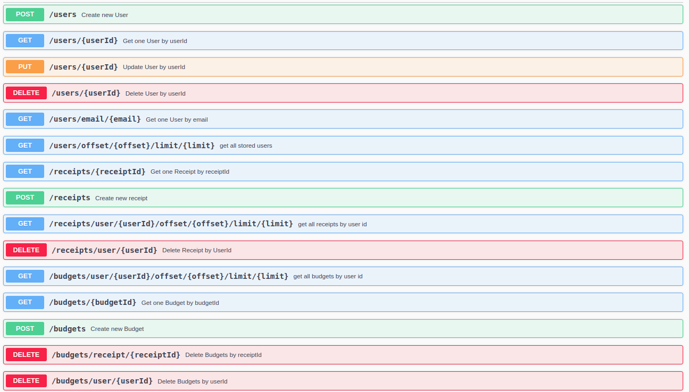
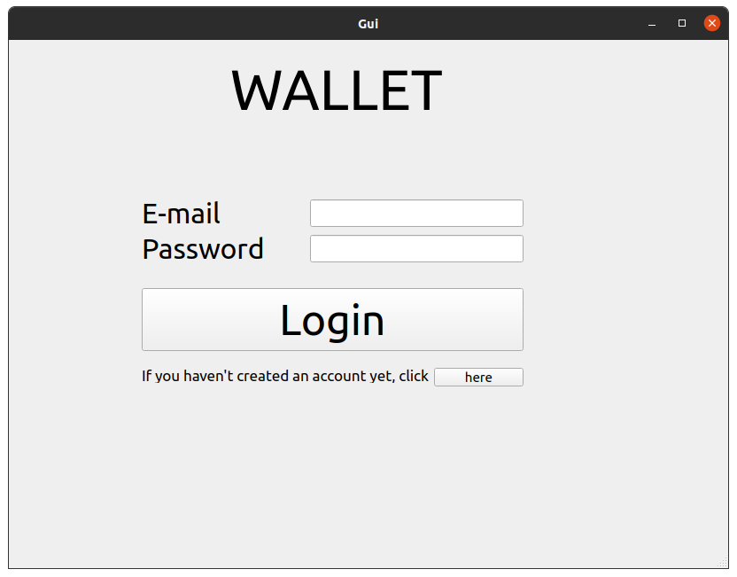
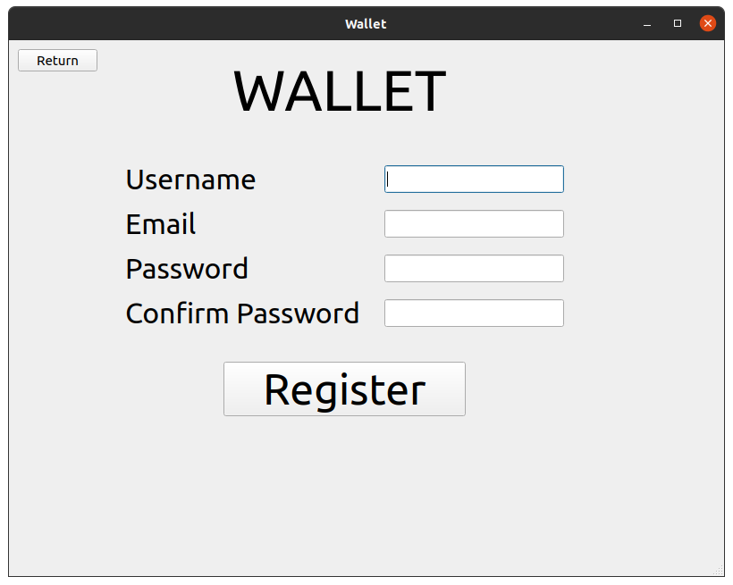
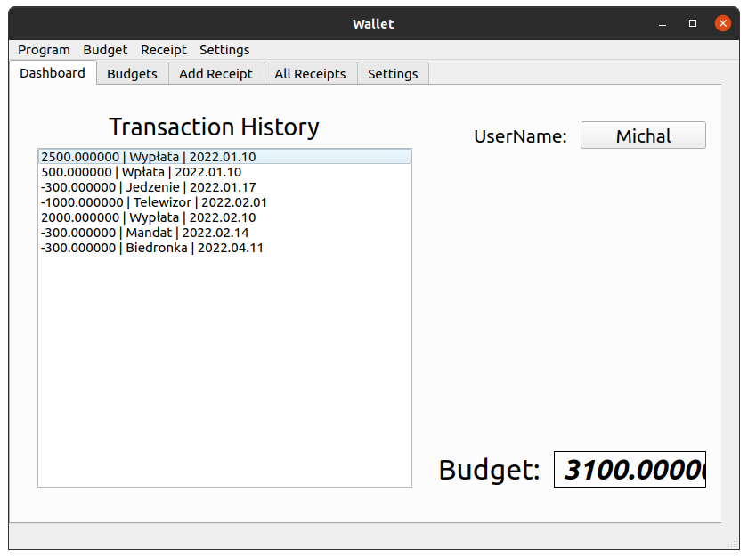
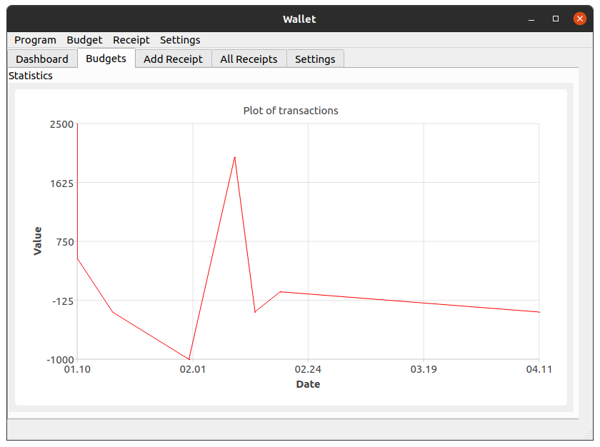
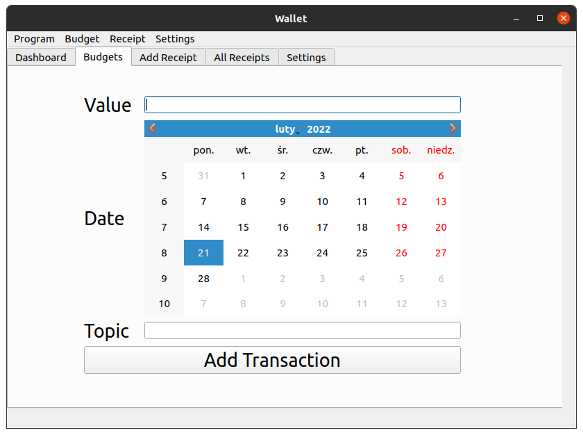
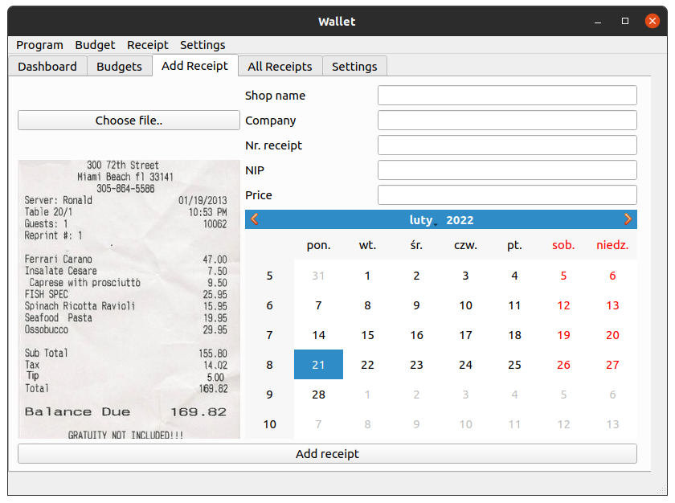
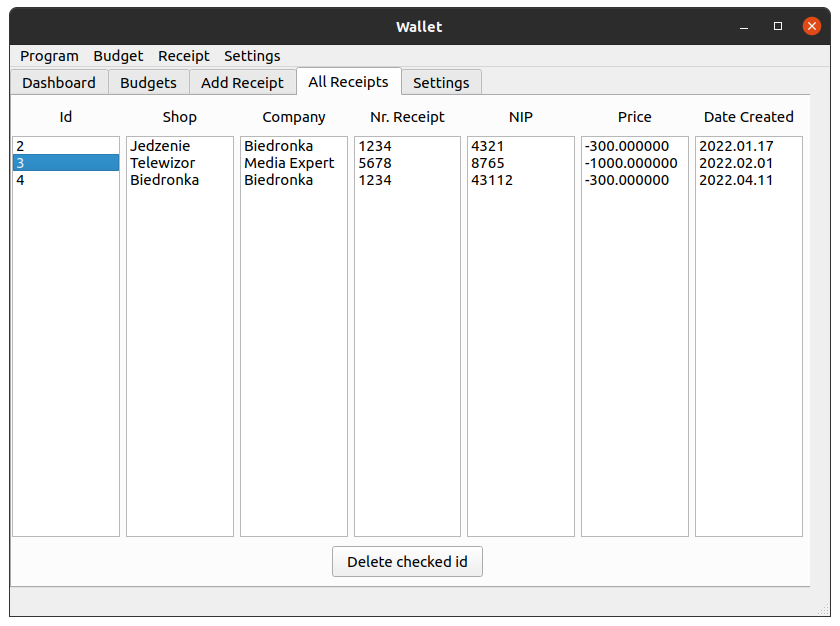
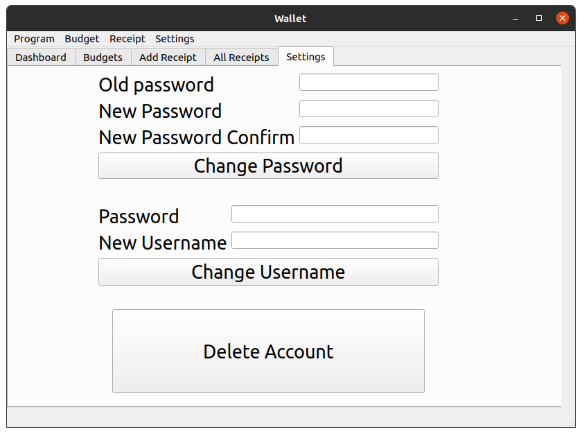
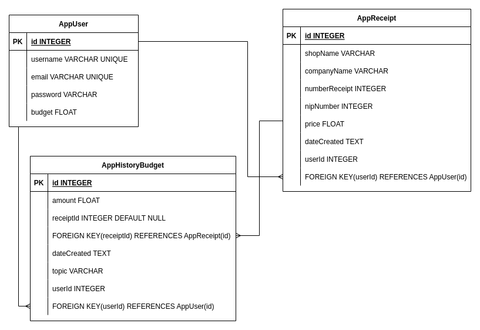

## Table of contents
* [Description](#description)
* [Technologies](#technologies)
* [Ilustrate](#ilustrate)
* [Features](#features)
* [Project Status](#project-status)

# Wallet ([walletapi.michalwrona.pl](https://walletapi.michalwrona.pl/swagger/ui))
## Description
The application was created as part of a project during studies on the subject of "Programming in C++". The application combines the backend layer and desktop development. 
In the project I am using the Oatpp and Qt frameworks. Project Api is based on REST architecture and SQLite relational database.

# Technologies
* [C++](https://docs.microsoft.com/en-us/cpp/?view=msvc-170)
* [Qt](https://www.qt.io/)
* [Oatpp](https://oatpp.io/)
* [SQLite](https://www.sqlite.org/index.html)
* [Swagger](https://swagger.io/)

# Ilustrate
## API

## GUI
### Login

### Register

### Transactions History

### Statistics

### Budget Add

### Add Receipt

### Delete Receipt

### Settings

## Data Base
### Diagram

## Video of the program
https://user-images.githubusercontent.com/73277848/159808781-96e6343c-7634-479b-9d9d-4d384b3cfa01.mp4

# Features
- History transations
- Add budget
- Add receipt
- Delete receipt
- View chart value of date
- View all receipt
- Change password
- Delte account
- Change username
- Login
- Logout

# Project status
The project was completed and scored 5.0.

# Contact to me
E-mail: wronamichal01@gmail.com
